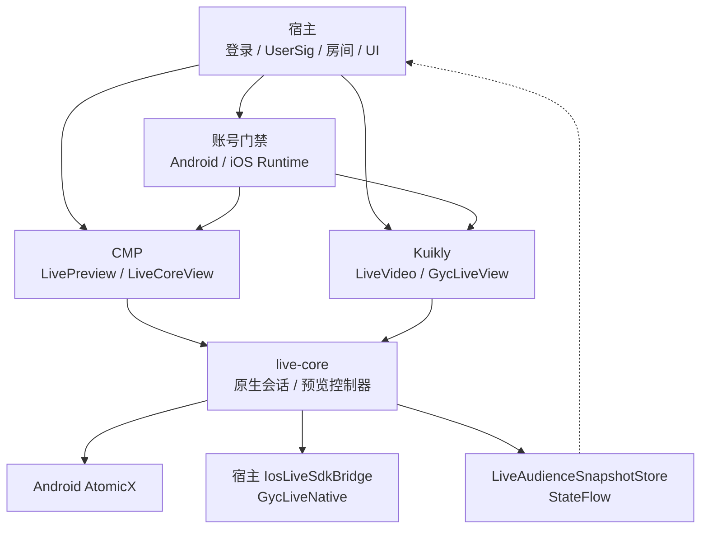
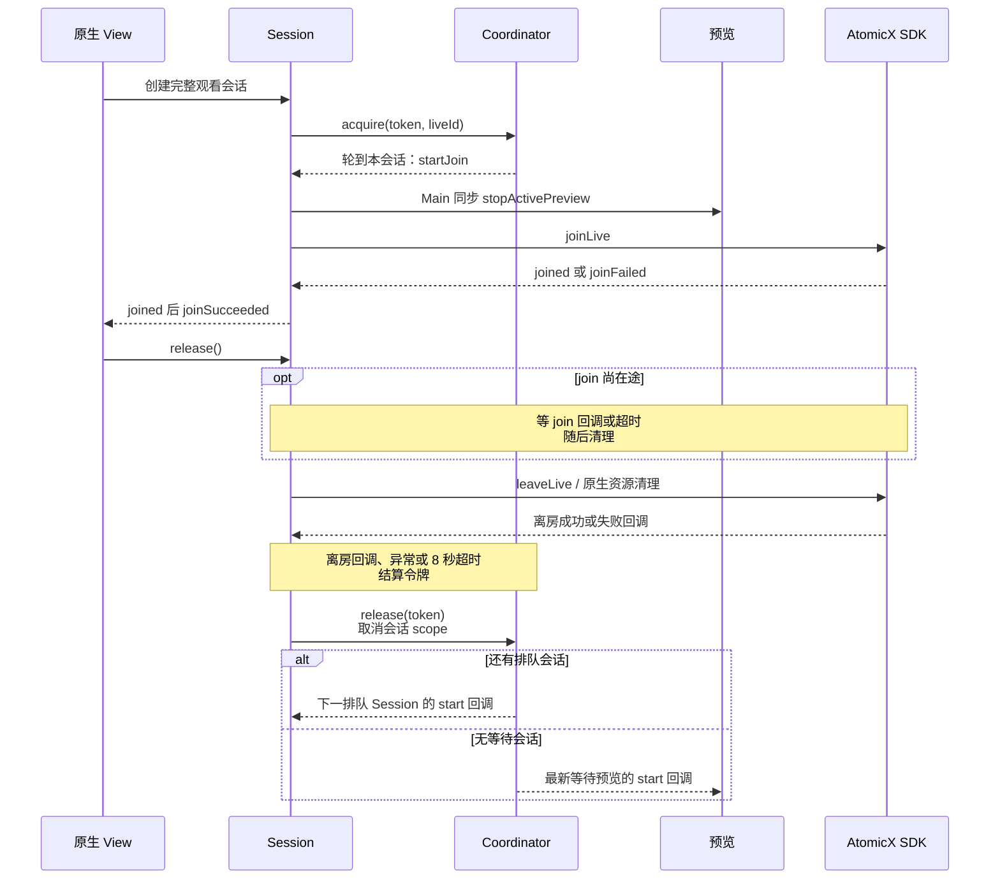
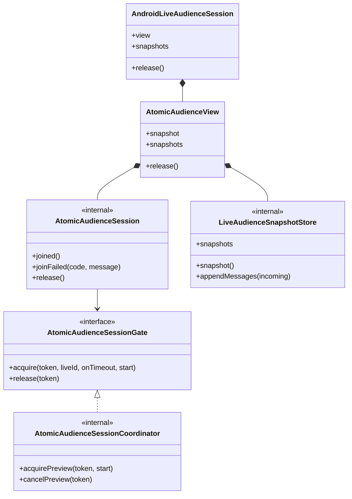

# GY CrossKit Live SDK

基于腾讯 AtomicX 的 Android/iOS 直播观看组件，支持列表静音预览、完整观看、原生视频画面和互动命令。CMP 与 Kuikly Native DSL 共用账号门禁、会话与状态；应用提供 SDKAppId、服务端 UserSig、业务账号、房间路由和操作 UI。

当前 Maven / Git Pod 候选 **0.2.1-rc.7**：补 Kuikly PiP public/native 接线，复用 core；请求受理与真实系统状态分开，Swift换房撤销旧缓存事件。**未发布，待候选构建及真实远程消费核验**。上版 `0.2.1-rc.6` 已发布，其历史验收不代算新候选。完整范围见[完整源码审查](docs/完整源码审查.md)。

上一轮 Maven 预发行 **0.2.1-rc.5** 已发布，修复 Renderer 停止预览的线程边界和退出后的 SDK 回调隔离：Renderer 使用 `stopActivePreviewAndAwait()`，同步 `stopActivePreview()` 仅供 Main 调用。Android 38 项、iOS Simulator 35 项测试与 iOS arm64 编译、完整归档、公开 Release 下载 SHA 和 JitPack 制品审计均通过，见 [rc.5 验收记录](docs/0.2.1-rc.5远程发布验收.md)。该轮原生 Swift 源码未变，配套已验 Git Pod `0.2.1-rc.3`；独立消费者与设备验收单独记录，历史结果见 [M19 记录](docs/M19验证记录.md)。


PiP 的 `accepted` 只表示请求受理；观看snapshot/event由两端真实平台或宿主生命周期回报驱动，关闭会话清理false。iOS实验接口准备成功不更新actual状态。

## 架构与调用流程

宿主先完成真实 SDK 登录，再更新组件账号门禁；iOS KMP 还需安装宿主桥。CMP 与 Kuikly Native DSL 复用 `live-core`，共享观看会话规则和唯一 StateFlow 快照，不各自维护一套 SDK 状态。



下面是 `AtomicAudienceSession` 的完整观看流程。会话排队、join 与 leave 分别有 15 / 20 / 8 秒期限；退出后仍须等离房结算再放行下一场，避免共享 Store 被旧房间回调误伤。



类型图聚焦 Android 完整观看链路（内部状态机和快照累加器同样被 iOS KMP 平台层复用）。列表预览另由 `AtomicLivePreviewController` 管理，只有 active、页面 STARTED 和平台账号门禁满足时播放；失活或释放取消等待预览并用 generation 拒绝迟回调。注销前宿主先关闭账号门禁、停止预览，再清理账号。



源码入口：[Android 原生会话](live-core/src/androidMain/kotlin/io/github/gycrosskit/livesdk/AndroidLiveNativeSession.kt)、[AtomicAudienceView](live-core/src/androidMain/kotlin/io/github/gycrosskit/livesdk/AtomicAudienceView.kt)、[共用会话状态机](live-core/src/commonMain/kotlin/io/github/gycrosskit/livesdk/AtomicAudienceSession.kt)、[会话排队与预览门禁](live-core/src/commonMain/kotlin/io/github/gycrosskit/livesdk/AtomicAudienceSessionCoordinator.kt)、[预览生命周期](live-core/src/commonMain/kotlin/io/github/gycrosskit/livesdk/AtomicLivePreviewController.kt)、[唯一快照](live-core/src/commonMain/kotlin/io/github/gycrosskit/livesdk/LiveAudienceSnapshotStore.kt)、[Android 账号门禁](live-core/src/androidMain/kotlin/io/github/gycrosskit/livesdk/AndroidLiveSdkRuntime.kt)、[iOS 桥安装](live-core/src/iosMain/kotlin/io/github/gycrosskit/livesdk/IosLiveSdkRuntime.kt)。OHOS 没有发布实现；Kuikly PiP 请求与状态同步同样复用平台会话，`accepted` 仅表示平台受理。

## 平台与模块

| 模块 | 平台 | 能力 |
| --- | --- | --- |
| `live-sdk` | Android、iOS | CMP `LivePreview` / `LiveCoreView` |
| `live-core` | Android、iOS | SDK 账号门禁、观看会话、状态、互动和 iOS Bridge |
| `live-kuikly` | Android、iOS | Kuikly Native DSL 与薄原生视频 View，无 CMP UI/runtime |
| `GycLiveNative` | iOS | 独立 Swift CocoaPod，AtomicX 账号/视频/互动/IM/RoomEngine 系统 PiP；Git Pod `0.2.1-rc.6` 已发布并完成远程消费；历史已验 `0.2.1-rc.3` |

Android 最低 API 24。iOS Native 链接的已验证部署基线为 iOS 15，应用同时遵循所选腾讯 SDK 的部署要求。已验证工具链为 Kotlin `2.2.21`、AGP `8.10.1`、CMP `1.10.3`、Kuikly `2.28.0-2.0.21-ohos` / Render `2.28.0`。

**HarmonyOS 暂无发布实现、OHOS target 或 HAR**；现有 AtomicX `liveId` 协议尚无等价接线。Kuikly Compose DSL 也不在当前验证范围。

## 安装

在 `settings.gradle.kts` 添加依赖仓库：

```kotlin
dependencyResolutionManagement {
    repositories {
        exclusiveContent {
            forRepository {
                maven("https://mirrors.tencent.com/nexus/repository/maven-tencent/")
            }
            filter { includeGroup("com.tencent.kuikly-open") }
        }
        google()
        mavenCentral()
        maven("https://jitpack.io") {
            content { includeGroup("com.github.gycrosskit.live-sdk") }
        }
        maven("https://mirrors.tencent.com/nexus/repository/maven-tencent/")
        maven("https://mirrors.tencent.com/repository/maven/thirdparty/")
    }
}
```

Kuikly group 固定从腾讯 Maven 读取 metadata 和实际产物，避免其他镜像先返回 metadata、随后 AAR 缺失时 Gradle 无法切源。此规则只匹配 `com.tencent.kuikly-open`，保留其他 SDK 的仓库选择；本轮响应与边界见 [rc.5 验收记录](docs/0.2.1-rc.5远程发布验收.md)。

在 KMP 的 `commonMain.dependencies` 按 UI 引擎选择，同一应用全部模块固定同版本：

```kotlin
// CMP
implementation("com.github.gycrosskit.live-sdk:live-sdk:0.2.1-rc.7")
// Kuikly Native DSL
implementation("com.github.gycrosskit.live-sdk:live-kuikly:0.2.1-rc.7")
```

Android 传递依赖 `atomicx-core:4.3.3.29` 和 `imsdk-plus:9.1.7818`。iOS 应用保留 `IosLiveSdkBridge` 的薄协议映射。原生 Pod `GycLiveNative` 承接 SDK 实现，独立于 `Shared.framework`，厂商版本固定为 AtomicXCore `4.3.9`、RTCRoomEngine/Professional `4.3.9` 和 IM `9.1.7818`；Kuikly 另外加入配套标签的 `GycLiveView.swift` 与 `OpenKuiklyIOSRender`，已验接线见历史 [GycLiveView.swift](https://github.com/gycrosskit/live-sdk/blob/0.2.1-rc.3/live-kuikly/ios/GycLiveView.swift)。KLIB 不能代替原厂 SDK 或 Swift 接线，详见 [接入指南](docs/接入指南.md)。

## iOS 原生接入

`GycLiveNative` 通过不可变 Git 标签安装。`0.2.1-rc.3` 的 JitPack 全变体下载、远程 Gradle 消费与 Git Pod UIKit 最终链接已通过，见 [M19 记录](docs/M19验证记录.md) 和[同版本预发布](https://github.com/gycrosskit/live-sdk/releases/tag/0.2.1-rc.3)。本仓库没有 Swift Package 或 CocoaPods Specs 发布。以下为 `0.2.1-rc.7` 候选安装方式，待发布与精确标签远程消费核验：

```ruby
pod 'GycLiveNative', :git => 'https://github.com/gycrosskit/live-sdk.git', :tag => '0.2.1-rc.7'
```

纯 UIKit 应用可 `import GycLiveNative` 后复用 `GycLiveClient.shared`。KMP 应用继续安装自己的 `IosLiveSdkBridge`，把 Shared 回调映射为组件的 Swift 协议。账号准备与 UserSig、观看排队与超时、业务 IM 解析、前台可拖动小窗和 UI 仍由宿主负责。完整 API、释放与系统 PiP 边界见 [接入指南](docs/接入指南.md#ios-原生-cocoapod)。当前候选组合为 Maven `0.2.1-rc.7` + Native Pod `0.2.1-rc.7`；各渠道待新候选真实远程核验。

## 快速使用

先完成真实 SDK 登录，再设置账号门禁：Android 调用 `AndroidLiveSdkRuntime.updateSessionReady(true)`；iOS 先 `IosLiveSdkRuntime.install(bridge)`，登录成功后调用 `updateSessionReady(true)`。组件不生成 UserSig，也不主动替应用登录。

Renderer/后台协程在后续登录、重置或完整进房前，调用平台 Runtime 的 `stopActivePreviewAndAwait()`，挂起等待 Main 停止 SDK 预览并移除 View。原有同步 `stopActivePreview()` 保留 Main 即时语义，后台调用会立即拒绝；不要用阻塞等待连接 Renderer 与 Main。具体账号和回调合同见 [线程与停止顺序](docs/接入指南.md#线程与停止顺序)。

```kotlin
import androidx.compose.runtime.Composable
import androidx.compose.ui.Modifier
import androidx.compose.foundation.layout.size
import androidx.compose.ui.unit.dp
import io.github.gycrosskit.livesdk.LivePreview

@Composable
fun PreviewItem(liveId: String, visible: Boolean) {
    LivePreview(
        liveId = liveId,
        active = visible,
        modifier = Modifier.size(320.dp, 180.dp),
    )
}
```

完整观看使用 `LiveCoreView`；Kuikly 使用 `LiveVideo` 并注册原生 `GycLiveView`。预览只在页面具备 LifecycleOwner、处于 STARTED 且 `active=true` 时播放。完整接线和互动回调见 [接入指南](docs/接入指南.md)。

## 生命周期与能力边界

- 业务动作应等待 `joinSucceeded`，不能把请求提交或画面创建当成进房成功。
- 完整观看与列表预览互斥；释放后等待 SDK 离房回调或既有超时，才放行下一会话。旧回调不能更新新房间。
- 注销或撤销播放资格前先关闭账号门禁、停止预览，再执行应用的账号清理。CMP、Kuikly 不应另建第二套 SDK 账号状态。
- 组件提供视频与互动命令，不提供完整直播间 UI、礼物、上麦、开播、服务端协议；Kuikly PiP 命令复用 core，actual 状态由真实系统或宿主回报。

## 文档与反馈

- [共享腾讯身份与中立 IM 源](docs/共享腾讯身份.md)
- [SDK 账号、CMP/Kuikly 与 iOS 接入](docs/接入指南.md)
- [源码开发与验证](docs/开发与验证.md)、[验证记录](docs/验证记录.md)
- [HarmonyOS SDK 调研与限制](docs/腾讯鸿蒙直播SDK调研.md)
- [版本发布](https://github.com/gycrosskit/live-sdk/releases)、[问题反馈](https://github.com/gycrosskit/live-sdk/issues)

由 GY CrossKit 维护。反馈请提供组件/原厂 SDK/系统版本、脱敏事件顺序与最小复现，不提交真实 UserSig 或账号凭据。

## 许可证

[Apache-2.0](LICENSE)。腾讯 SDK 与 Kuikly Render 遵循各自原厂许可，组件不重新分发 proprietary SDK。

## 0.2.1-rc.4 历史候选

观众快照只由现有 `StateFlow` 保存，`snapshot()` 与订阅者读取同一份状态，回调通过 `copy` 保留其他字段。
弹幕队列、去重 key、有界容量与合成序号继续独立维护；平台回调原有主线程串行语义保持。

本轮 core Android 35 项、Simulator 32 项测试和 core/CMP/Kuikly Android、iOS arm64/Simulator 编译通过；未执行真实直播业务。

| rc.4 渠道 | 配套版本 |
| --- | --- |
| Maven / Git Pod | `0.2.1-rc.4` / `0.2.1-rc.3` |

Android AtomicX 4.3.3.29 + IM 9.1.7818；iOS AtomicX/RoomEngine 4.3.9 + IM 9.1.7818；Kuikly Render 2.28.0。候选已完成发布与新版本远程消费；设备行为不由编译/链接推断。

## 0.2.1-rc.4 发布与远程验收

Fresh macOS staging 与归档解包复验均通过，全部 15 个 publication 的声明文件四类哈希、四类 sidecar、Apache-2.0 POM 及同名 available-at 目标身份均已校验。Maven 归档 SHA-256：`7ab65c2249f8284f57ae59bba03b40e600dcf76c735033cf34e4377a665a67b3`。

Maven `0.2.1-rc.4`；未变 GycLiveNative Git Pod 保留 `0.2.1-rc.3`。

不可变标签与 prerelease 已发布，所有 Release 附件重下载 SHA 与清单匹配。JitPack 新版本最终 ok/isTag/public 且 commit 匹配 tag，全部 15 module、18 个文件引用、15 个 available-at 的 HTTP/四类声明 hash/身份验证通过。新版真实远程 consumer 已通过；设备与业务 SDK 动作未验。

精确 JitPack rc.4 新目录消费者：Kuikly 43 tasks / 43s，APK/D8、verifyNoCompose、verifySingleSdk（core/AtomicX 唯一依赖）、iOS 三架构编译和 device/simulator arm64 static Framework；CMP 19 tasks / 19s，Android 与 iOS 三架构编译。未变 Git Pod rc.3 沿用既有真实 UIKit 链接证据，本轮不重复发布或编译旧 Pod。

实际日志与 JSON 账单位于 `build/remote-library-review/`。真实设备、业务账号登录/聊天/直播/PiP、权限 UI、真实 Bug/通知发送未执行。

## 0.2.1-rc.6 本轮测试与远程验收

2026-10-05：本轮自有源码和公开 API 审查、关键回归与受影响平台编译通过；真实 JitPack `0.2.1-rc.6` 的最终标签提交、15 个 publications 的 POM/Module、所有变体文件大小与四种声明哈希、内部精确版本及 available-at 均通过。Release Maven 归档重新下载 SHA-256 为 `6dc24dfab7b3309a58591b14c1ed3cb97605cbaf048ca3236c0410eb69ac35bb`。公开 MD5/SHA-1 sidecar 通过；SHA-256/SHA-512 sidecar 的 HTTP 404 记录为渠道缺失。

干净消费工程使用固定远程版本，没有本地 Maven、includeBuild 或其他组件源码替代；通过现有入口的 Android/iOS 编译和相应最终链接。 Kuikly 与 CMP 分别验证。 新 Git Pod 从远程标签安装，实际编译 Swift 与标签逐字节匹配，纯 UIKit iphoneos arm64 App 链接通过。

完整回归范围、精简原则、注释契约与仍需设备/业务验收的边界见 [14 个功能组件测试与 API 审查](https://github.com/gycrosskit/.github/blob/main/docs/组件测试与API审查.md)。源码测试与远程消费不代替真机和厂商业务验收。
